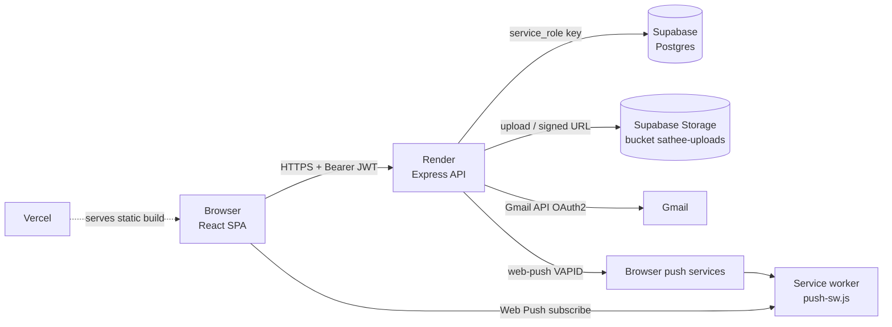

# HCL SATHEE

A multi-centre learning-management portal for the **HCL SATHEE** programme. It lets a central team (Admins), centre-level HCL Partners and on-the-ground Sathee Mitras run coaching Kendras (centres) end to end: student enrolment, class attendance with photo proof, mentor attendance and leave, test marks, progress analytics, timetables, teaching schedules, announcements, support queries and printable Kendra reports.

- **Frontend:** React 19 + Vite, deployed on **Vercel**
- **Backend:** Node.js + Express 5 REST API, deployed on **Render**
- **Database and file storage:** **Supabase** (PostgreSQL + Supabase Storage)
- **Notifications:** Web Push (VAPID) and Gmail API email

**More documentation:** [PAGES.md](PAGES.md) shows which role can open which page, and [MANAGEMENT.md](MANAGEMENT.md) explains what every button does and describes every file in the repository.

---

## Table of contents

1. [Roles at a glance](#1-roles-at-a-glance)
2. [Architecture](#2-architecture)
3. [Repository layout](#3-repository-layout)
4. [Core concepts](#4-core-concepts)
5. [Getting started (local development)](#5-getting-started-local-development)
6. [Environment variables](#6-environment-variables)
7. [Database and storage](#7-database-and-storage)
8. [Authentication and security](#8-authentication-and-security)
9. [Permission matrix](#9-permission-matrix)
10. [Admin operations](#10-admin-operations)
11. [HCL Partner operations](#11-hcl-partner-operations)
12. [Sathee Mitra operations](#12-sathee-mitra-operations)
13. [Notifications and emails](#13-notifications-and-emails)
14. [REST API reference](#14-rest-api-reference)
15. [Frontend internals](#15-frontend-internals)
16. [Deployment](#16-deployment)
17. [Scripts and tests](#17-scripts-and-tests)
18. [Known limitations](#18-known-limitations)
19. [Troubleshooting](#19-troubleshooting)

---

## 1. Roles at a glance

| Role (stored as) | Who they are | Scope | Summary |
|---|---|---|---|
| **Admin** (`ADMIN`) | Central programme team | All centres | Full control: users, students, centres, announcements, attendance approval, leave decisions, support replies, reports |
| **HCL Partner** (`HCL PARTNER`) | HCL representative for one centre | Own centre only | Read-only oversight: dashboard, attendance, analytics, students, announcements; can raise support queries |
| **Sathee Mitra** (`SATHEE MITRA`) | Mentor / teacher at a centre | Own centre only | Operational: marks own attendance with camera, takes class attendance, enters test marks, manages students, timetable and schedule, applies for leave |
| **Sathee Vishist** (a Mitra with `isVishist = true`) | Visiting subject mentor | Own centre | A Mitra sub-type. Their teaching sessions are logged by other Mitras ("Vishist attendance") and they have configurable weekly available days |

There is **no self sign-up**. Every account is created by an Admin, who sends an invite link by email.

---

## 2. Architecture



- The browser **never talks to Supabase directly**. All data goes through the Express API, which holds the Supabase `service_role` key. Row Level Security is therefore left off; access control is enforced in the API layer (JWT + role middleware + centre scoping).
- The SPA is served by Vercel with a catch-all rewrite to `index.html` (`Client/vercel.json`).
- Centre scoping is enforced **server-side** for Partner and Mitra requests (`filterByUserCentre`, `matchesCentre`), and additionally filtered in the UI for Admins browsing one centre at a time.

### Tech stack

| Layer | Technology |
|---|---|
| Client | React 19, Vite 8, Tailwind CSS 4, React Router 7, Axios, Recharts, jsPDF + jspdf-autotable, SheetJS `xlsx`, lucide-react, vite-plugin-svgr |
| Server | Node.js (20+ recommended), Express 5, `@supabase/supabase-js`, `jsonwebtoken`, `bcryptjs`, `helmet`, `cors`, `express-rate-limit`, `multer`, `googleapis` (Gmail), `web-push`, `dotenv` |
| Data | Supabase Postgres (schema in `Server/supabase/schema.sql`), Supabase Storage |
| Hosting | Vercel (Client), Render web service (Server), Supabase (DB + files) |

---

## 3. Repository layout

```
HCL Sathee/
├── Client/                         React SPA (Vite)
│   ├── public/
│   │   ├── push-sw.js              Web Push service worker
│   │   └── favicon.svg
│   ├── src/
│   │   ├── App.jsx                 Routes, role guards, session state, nav config
│   │   ├── Pages/                  One folder per feature (Auth, Dashboard, Attendance,
│   │   │                           Analytics, User, Student, Announcements, Support,
│   │   │                           TestMarks, Schedule, Report, Profile, Selector)
│   │   ├── Components/             Feature components (Analytics, Attendance, Auth, Dashboard,
│   │   │                           Announcements, Schedule, Selector, Student, TestMarks, User, common)
│   │   ├── services/               Axios wrappers, one file per backend resource
│   │   ├── utils/                  Auth session, exports (XLSX/SVG/PDF), course/subject rules,
│   │   │                           centre directory, web push, image compression, sorting…
│   │   ├── config/api.js           Resolves the API base URL (VITE_API_URL)
│   │   └── Data/EquipmentCatalog.js  ~200 predefined equipment names/descriptions
│   ├── vercel.json                 SPA rewrite
│   └── vite.config.js              Dev server on :5173
└── Server/                         Express API
    ├── src/
    │   ├── index.js                App bootstrap, CORS, rate limits, route mounting
    │   ├── config/                 supabase.js (client), storage.js (uploads)
    │   ├── Middleware/             auth.js (JWT + role guards), rateLimits.js
    │   ├── Routes/                 One router per resource
    │   ├── Controllers/            Request handlers and business rules
    │   ├── Models/                 Supabase data access, one per table
    │   └── Utils/                  Passwords, tokens, OTP, email, push, course rules, centre matching
    ├── supabase/schema.sql         Full database schema (idempotent)
    ├── scripts/                    Legacy maintenance scripts (see §17)
    └── tests/                      Node assertion tests
```

---

## 4. Core concepts

### 4.1 Centres (Kendras)

Everything is partitioned by **centre**. Three centres ship as defaults and can never be renamed or deleted; Admins can add more.

| Portal | Centre value | Kendra ID | Place |
|---|---|---|---|
| HCL SATHEE RAJASTHAN | `HCL RAJASTHAN` | `RJ-JU-01` | Jhunjhunu, Rajasthan |
| HCL SATHEE JHARKHAND | `HCL JHARKHAND` | `JH-EM-01` | East Singhbhum, Jharkhand |
| HCL SATHEE MADHYA PRADESH | `HCL MADHYA PRADESH` | `MP-BT-01` | Bhopal, Madhya Pradesh |

- The Kendra directory (ID, place, address) is hard-coded in `Client/src/utils/centreDirectory.js` and mirrored in `Server/src/Utils/centreDirectory.js`. Custom centres have no Kendra ID (shown as "—").
- Centre names are compared with a **canonical key** (uppercase, letters only, with rules for `RAJASTHAN`/`RAJATHAN`, `JHARKHAND`, `MADHYAPRADESH`), so `"hcl rajasthan"` and `"HCL RAJATHAN"` match. See `getCanonicalCentreKey` in `centreMatch.js`.
- New centres are normalised to `HCL <NAME>` form (e.g. `HCL UTTAR PRADESH`). A custom centre can only be renamed or deleted while **no students, users or equipment** are assigned to it.
- Users carry one `centre`. Admins may open any centre's portal; Partners and Mitras can open only their own.

### 4.2 Courses and subjects

Eight courses are supported (`Server/src/Utils/courseSubjects.js`, mirrored on the client):

| Course | Subjects |
|---|---|
| JEE | Physics, Chemistry, Mathematics |
| NEET | Physics, Chemistry, Biology |
| SSC | Quantitative Aptitude, Reasoning Ability, English Language, General Awareness |
| CLAT | English Language, Current Affairs & General Knowledge, Legal Reasoning, Logical Reasoning, Quantitative Techniques |
| IBPS | Quantitative Aptitude, Reasoning Ability, English Language, General Awareness, Computer Knowledge |
| RRB | Mathematics, General Intelligence & Reasoning, General Science, General Awareness, Current Affairs |
| ICAR | Compulsory: Physics, Chemistry. Choose **exactly one** of Mathematics, Biology, Agriculture |
| CUET | Compulsory: Language, General Test. Choose **1 to 6** domain subjects from Physics, Chemistry, Mathematics, Biology, Agriculture, Accountancy, Business Studies, Economics, History, Political Science, Geography, Psychology, Sociology, Computer Science, Informatics Practices, Physical Education, Fine Arts, Home Science, Entrepreneurship |

Course text is normalised (`"IPBS"` is accepted as `IBPS`). Subject selection is validated on both client and server; fixed-subject courses ignore any extra subjects.

### 4.3 Student IDs

- **Student ID** is generated per Kendra and locked in the form: the Kendra ID loses its trailing `-NN` and gets a zero-padded sequence, e.g. `RJ-JU-001`, `RJ-JU-002`. The counter lives in Postgres (`student_id_counters`, atomically incremented by the `increment_student_counter` RPC), so concurrent adds never collide.
- Custom centres without a Kendra ID fall back to `STU` + 6 digits.
- **Enrollment number** defaults to `ENR` + 6 digits.
- Student **email is unique**; phone numbers must be exactly 10 digits.

### 4.4 Test types and tests

| Test type (code) | UI label | Slots shown in analytics |
|---|---|---|
| `performance` | Weekly | Week 1, Week 2, Week 3 |
| `pre-mid` | Monthly (Pre-Mid) | Month 1, Month 2, Month 3 |
| `mid` | Six months (Mid) | Mid 1, Mid 2, Mid 3 |

A **test** is just a named container per course and centre (auto-numbered). The *type* is attached when marks are saved against it, so one test record is not tied to a type until marks exist.

### 4.5 Attendance kinds

| Kind | Who is recorded | Recorded by | Evidence | Table |
|---|---|---|---|---|
| **Class (student) attendance** | Students, per subject, date and time slot | Mitra (or Admin API) | Optional class photo | `daily_subject_attendances` (rolled up into `subject_attendances`) |
| **Mitra attendance** | The Mitra themselves | The Mitra, with a live camera photo for arrival and for departure | Photo (required) | `mitra_attendances` |
| **Vishist attendance** | A Vishist mentor's teaching session (subject, topic taught) | Any Mitra or Admin | Optional photo | `vishist_attendances` |

Attendance percentages: for students, `present days ÷ days attendance was taken`; weekly/monthly views average each day's percentage (days without records count as 0 in the Kendra Report). Status bands used everywhere: **90+ Excellent, 85–89 Good, 80–84 Average, below 80 Low**.

### 4.6 Notifications preference

Push notifications are opt-in per browser through a Yes/No banner on every dashboard (see [§13](#13-notifications-and-emails)).

---

## 5. Getting started (local development)

### Prerequisites

- Node.js 20 or newer and npm
- A Supabase project (free tier is fine)
- Optional: a Google Cloud OAuth client for Gmail (only needed to send real emails)

### 5.1 Set up Supabase

1. Create a project at supabase.com.
2. Open **SQL Editor**, paste the entire contents of `Server/supabase/schema.sql` and run it. The script is idempotent and also grants table/sequence privileges to `service_role`.
3. Open **Storage** and create a bucket named **`sathee-uploads`** (private is fine; the server issues long-lived signed URLs, and falls back to public URLs if the bucket is public).
4. From **Project Settings → API**, copy the **Project URL** and the **`service_role` secret key**.

### 5.2 Configure and run the server

```bash
cd Server
npm install
cp .env.example .env      # then fill in the values (see §6)
npm run dev               # nodemon, http://localhost:5000
```

On boot you should see `✅ Supabase Connected Successfully` and `🚀 Server running…`. The server exits if `SUPABASE_URL` or `SUPABASE_SERVICE_ROLE_KEY` is missing.

Generate a VAPID key pair for push notifications:

```bash
npx web-push generate-vapid-keys
```

### 5.3 Configure and run the client

```bash
cd Client
npm install
```

Create `Client/.env`:

```
VITE_API_URL=http://localhost:5000
VITE_VAPID_PUBLIC_KEY=<the VAPID public key generated above>
```

```bash
npm run dev               # http://localhost:5173
```

### 5.4 Create the first Admin

Because nobody can sign up, seed the first Admin directly in Supabase (SQL editor):

```sql
insert into users (name, email, phone, role, centre)
values ('Your Name', 'you@example.com', '9876543210', 'ADMIN', 'HCL RAJASTHAN');
```

Then give that account a password with either route:

- **Forgot-password flow** (needs Gmail configured): on the login page choose *Forgot password*, enter the email, enter the 6-digit code, set a password. Login later requires the **exact name** stored in the row.
- **Manual hash:** generate a bcrypt hash and set it directly:
  ```bash
  node -e "require('bcryptjs').hash('Str0ng!Passw0rd',12).then(console.log)"
  ```
  ```sql
  update users set password = '<hash>' where email = 'you@example.com';
  ```

After that the Admin creates every other account from **Users & Roles**.

### 5.5 Useful commands

| Where | Command | Purpose |
|---|---|---|
| Server | `npm run dev` | Start API with auto-reload |
| Server | `npm start` | Start API (production) |
| Server | `npm test` | Run the Node assertion tests |
| Client | `npm run dev` | Vite dev server on port 5173 |
| Client | `npm run build` | Production build into `dist/` |
| Client | `npm run preview` | Serve the production build locally |
| Client | `npm run lint` | ESLint |

---

## 6. Environment variables

### Server (`Server/.env`, or Render → Environment)

| Variable | Required | Purpose |
|---|---|---|
| `SUPABASE_URL` | Yes | Supabase project URL |
| `SUPABASE_SERVICE_ROLE_KEY` | Yes | Supabase secret (service role) key. **Server only, never expose** |
| `SUPABASE_STORAGE_BUCKET` | No | Storage bucket name. Defaults to `sathee-uploads` |
| `JWT_SECRET` | Yes | Signs login, invite and reset tokens. Changing it logs everyone out and invalidates invite links |
| `CLIENT_URL` | Yes | Public URL of the SPA, used to build invite links in emails (e.g. `https://hcl-sathee.vercel.app`) |
| `PORT` | No | Defaults to 5000 locally; Render injects its own |
| `VAPID_PUBLIC_KEY` | For push | Web Push public key |
| `VAPID_PRIVATE_KEY` | For push | Web Push private key. **Server only** |
| `VAPID_SUBJECT` | For push | Contact URI, e.g. `mailto:you@example.com` |
| `EMAIL_USER` | For email | Gmail address that sends mail |
| `EMAIL_CLIENT_ID` | For email | Google OAuth client ID |
| `EMAIL_CLIENT_SECRET` | For email | Google OAuth client secret |
| `EMAIL_REFRESH_TOKEN` | For email | OAuth refresh token for `EMAIL_USER` (Gmail send scope) |
| `MAX_CONCURRENT_UPLOADS` | No | Cap on simultaneous file uploads (default 4; extra requests get 503 "server busy") |

Push and email failures are logged but never break the request that triggered them.

### Client (`Client/.env`, or Vercel → Environment Variables)

| Variable | Purpose |
|---|---|
| `VITE_API_URL` | Base URL of the API (Render). Falls back to the value hard-coded in `Client/src/config/api.js` if unset |
| `VITE_VAPID_PUBLIC_KEY` | Must equal the server's `VAPID_PUBLIC_KEY` **exactly** |

`VITE_` variables are compiled into the JavaScript bundle at build time and are public. **Changing them on Vercel requires a redeploy.** Do not mark them as "Secret" in Vercel (Vercel rejects secret visibility for public-prefixed variables).

`.env` files are git-ignored; only `Server/.env.example` is tracked.

---

## 7. Database and storage

### 7.1 Tables (`Server/supabase/schema.sql`)

| Table | Purpose |
|---|---|
| `users` | Accounts: name, unique email and phone, bcrypt password (null until invite accepted), `role`, `centre`, `is_vishist`, `available_days`, `push_subscriptions` (JSON), OTP hash/expiry/attempts |
| `centres` | Admin-created centres (the 3 defaults are built in and merged in code) |
| `students` | Student profile: IDs, contact, `centre`, `course`, `category`, `address`, parents (JSON), `subjects`, marks/attendance/qualification JSON |
| `tests` | Named tests per course and centre, auto-numbered (`test_number`, `test_date`) |
| `test_subject_marks` | Marks per test × student × test type × subject (unique), percentage, answer-sheet URL/path, `entered_by`, cascade-deleted with their test |
| `daily_subject_attendances` | Per student × subject × date × time slot: status (`present`/`absent`), topic, photo. Unique on that combination |
| `subject_attendances` | Roll-up per student × subject: totals, `percentage`, and daily/weekly/monthly percentages |
| `subject_performances` | Per-subject marks records (seeded at student creation, `max_marks` default 100) |
| `mitra_attendances` | One row per Mitra per day: arrival/departure photo and time, `approved`, `approved_by`, percentages. Unique on `(user_id, date)` |
| `vishist_attendances` | Vishist teaching sessions: mentor, subject, `topic_taught`, photo, `status` (`pending`/`approved`), approver |
| `announcements` | Title, description, category, priority, posted-by, target `centre` + `other_centres`, attachment |
| `equipments` | Centre equipment inventory (name, description, quantity, serial number) |
| `leave_requests` | Mitra leave: dates, reason, `status` (`pending`/`approved`/`rejected`), reviewer, reviewed-at |
| `support_queries` | Partner/user queries with a JSON array of admin replies and a status (`Open`/`Replied`) |
| `schedules` | Teaching schedule rows per centre (keyed by canonical centre key) |
| `timetables` | Weekly timetable per centre: `grid` (days + slots) or `svg` (image) |
| `student_id_counters` | Per-Kendra sequence for student IDs |

- `updated_at` is maintained by a `set_updated_at()` trigger.
- Numeric IDs are `bigint generated by default as identity`.
- `vishist_attendances.firestore_id` is an unused leftover column from the earlier Firebase version; it is harmless and intentionally kept.

### 7.2 Storage

One bucket, `sathee-uploads`, with folder-style prefixes:

| Prefix | Content | Server upload limit |
|---|---|---|
| `announcements/` | Announcement attachments (PDF, DOC/DOCX, JPG, PNG, WEBP) | 10 MB |
| `mitra-attendance/<userId>/<date>/` | Arrival/departure photos | 8 MB, images only |
| `vishist-attendance/<userId>/<date>/` | Vishist session photos | 8 MB, images only |
| `class-attendance/<date>/<subject>/` | Class attendance proof photo | 8 MB, images only |
| `test-marks/<testId>/` | Answer sheets (PDF, image, DOC/DOCX) | 15 MB |
| `timetables/<centreKey>/` | Large SVG timetables | body limit 3 MB |

If a Storage upload fails, announcement attachments (≤ 600 KB) and Mitra photos (≤ ~700 KB) fall back to inline `data:` URLs; SVG timetables ≤ 700 KB are always stored inline.

---

## 8. Authentication and security

**Login.** `POST /api/auth/login` takes **full name, email and password**; the name must match the account exactly. Passwords are bcrypt hashes (12 rounds). On success the server returns a **JWT valid for 1 day** carrying `id, email, role, centre`. The client keeps the token and session in `sessionStorage`, so closing the tab signs the user out. Any `401` from the API clears the session and returns to the login page. "Remember me" stores name, email and a base64-encoded password in `localStorage` (obfuscation only, not encryption).

**Invite flow.** Admin creates a user, the server emails a link `CLIENT_URL/create-password?token=…` (a 24-hour JWT with the user's name, email and role). The user sets a password on that page. The link works only while the account still has no password; **Resend invite** issues a fresh link. For `@example.com` test addresses the email is skipped and the link is returned to the Admin instead. If Gmail sending fails, the UI shows the error and a copyable setup link.

**Password policy** (client and server): at least 8 characters with an uppercase letter, a lowercase letter, a digit and a special character.

**Forgot password** (three steps, all rate limited):
1. `request-otp` emails a 6-digit code (always returns a generic response, so account existence is not revealed).
2. `verify-otp` checks the code (bcrypt-hashed, expires in **10 minutes**, max **5 attempts**, single-use) and returns a 10-minute reset token.
3. `reset` sets the new password using that token.

**Authorisation.** `authenticate` verifies the Bearer JWT, then role guards apply:

| Guard | Allows |
|---|---|
| `requireAdmin` | Admin |
| `requireSatheeMitra` | Mitra |
| `requireAdminOrMitra` | Admin, Mitra |
| `requireAdminOrPartner` | **Any of the three roles** (the name is historical; it accepts every portal-viewer role) |

Partner and Mitra data is always filtered to their own centre on the server.

**Hardening in place**
- `helmet` security headers; CORS allow-list: `https://hcl-sathee.vercel.app`, any `*.vercel.app`, `http://localhost:5173`, `http://127.0.0.1:5173`.
- Rate limits: login and forgot-password endpoints **8 requests/min**; all mutating requests **200/min**; heavy attendance-report endpoints **100/min**.
- JSON body limit 1 MB (3 MB for timetable and schedule saves); upload concurrency cap (503 when exceeded).
- Google Sheets import only fetches from `docs.google.com` / `drive.google.com` and rejects redirects to other hosts (SSRF guard), with a 2 MB and 15 s cap.
- Secrets live only in environment variables; `.env` files are git-ignored.

---

## 9. Permission matrix

✔ = allowed, — = not allowed, "own" = limited to the user's own centre. The server enforces these rules; the UI hides controls accordingly.

| Capability | Admin | Partner | Mitra |
|---|:--:|:--:|:--:|
| Choose any centre's portal | ✔ | own | own |
| Add / rename / delete centres | ✔ | — | — |
| See "Other Centres" overview | ✔ | — | — |
| Create, delete users; resend invites | ✔ | — | — |
| List users | all | own-centre Mitras | own-centre Mitras |
| Edit own name, email, phone | ✔ | ✔ | ✔ |
| Edit another user's days/phone/centre/Vishist flag | ✔ | — | — |
| View students | ✔ | own | own |
| Add / import / delete students | ✔ | — | own |
| Edit student details | ✔ | — | own (API allows; details view is read-only in the UI) |
| View student analytics and dashboards | ✔ | own | own |
| Take class (student) attendance | ✔ (API) | — | ✔ |
| Mark own arrival/departure with photo | — | — | ✔ |
| Approve Mitra attendance (within 24 h) | ✔ | — | — |
| Log / approve Vishist attendance | ✔ | — | ✔ |
| View Mitra attendance | ✔ | own | own |
| Apply for leave / see own requests | — | — | ✔ |
| Approve / reject leave | ✔ | — | — |
| Create / edit / delete announcements | ✔ | — | — |
| Read announcements | all | targeted at own centre | targeted at own centre |
| Add equipment | ✔ | — | — |
| View equipment | ✔ | own | own |
| Upload / replace / delete timetable and schedule | ✔ | — | own |
| View timetable and schedule | ✔ | own | own |
| Create tests, enter marks, upload answer sheets | ✔ | — | own |
| Delete a test and its marks | ✔ | — | own |
| Kendra Report and raw attendance/marks export | ✔ | — | — |
| Raise a support query | ✔ | ✔ | ✔ (API) |
| Read all queries and reply | ✔ | — | — |
| See own queries and replies | ✔ | ✔ | ✔ (API) |
| Enable push notifications | ✔ | ✔ | ✔ |

---

## 10. Admin operations

Admin sidebar: **Dashboard, Attendance Record, Progress and Analytics, Users & Roles, Students, Announcements, Queries, Kendra Report.** The header has **Other Centres** and **Logout**. An Admin first picks a centre portal; almost every page then shows data for that centre.

### 10.1 Signing in and choosing where to work

- **Login** with name, email and password. Cold servers may take up to ~90 s; the login screen retries automatically and shows "Waking up server…".
- **Home selector (`/`)** shows the internal *HCL SATHEE* card plus an external *SATHEE* card (see [Known limitations](#18-known-limitations)). Admins also see any **custom dashboards** they have added: an "ADD NEW DASHBOARD" card takes a name and an http(s) URL and stores it in the browser's `localStorage` only (no backend call). A custom card opens its URL in a new tab; its ✕ removes it immediately.
- **State portal selector (`/portals`)** lists the three default centres plus custom ones, each with its Kendra ID.
  - **Add a centre:** "ADD NEW CENTRE" → enter a name; the server normalises it (e.g. `HCL UTTAR PRADESH`) and rejects blanks and near-duplicates.
  - **Rename** (pencil) or **delete** (trash, with confirmation) a custom centre. Refused with a clear message while students, users or equipment still belong to it. Default centres are locked.
- **Other Centres (`/centres`)** shows one card per centre with a Default/Custom badge, "You're here" marker, Kendra ID and live headcounts: **Students, Sathee Mitras, Sathee Vishists, HCL Partners**. Refresh reloads; clicking a card asks to confirm, then switches portal and opens its dashboard.

### 10.2 Dashboard

- **Notification banner:** Yes/No toggle + Save to turn web push on or off for this browser.
- **Welcome banner:** greeting, an "Online" indicator and a clock (labelled "Last Login" but showing the current time).
- **Quick Actions:** *Add Students*, *View Attendance*, *View Timetable*, *View Schedule*.
- **Students by Course:** bar chart over the eight courses; hover shows student names.
- **Attendance pie:** Daily / Weekly / Monthly toggle for the centre (present vs absent, with percentage).
- **Batch Exam Progress:** one bar per course, the average of each student's latest weekly (`performance`) test percentage per subject. Colours: 80+ dark green, 60–79 green, 40–59 yellow, 25–39 orange, under 25 red; "No Students" when empty.

**Timetable modal (upload, replace, remove)**
- Upload `.xls`, `.xlsx`, `.csv` or `.svg`. Spreadsheets are read either as a **weekly grid** (a `Time`/`Timing`/`Period`/`Slot` column plus at least three weekday columns) or as **long form** (`Day`, `Time`, `Subject/Class/Course`). Cells should look like `JEE - Physics`. Rows containing "lunch", "break" or "recess" are highlighted as breaks. SVGs are shown as an image.
- Uploading saves to the server immediately. *Save / Sync to phone* re-syncs a local copy; *Remove* deletes it; *Template* downloads `hcl-sathee-timetable-template.xlsx`.
- The UI keeps a `localStorage` copy per centre and re-syncs it if the server copy is empty.

**Schedule modal (teaching plan)**
- Filters: Subject, Month, topic search. Columns: Topic, Planned Days, Start, End, Faculty, Completion bar, Status (Pending / In Progress / Completed; completion defaults to 0 / 50 / 100 when blank).
- Upload `.xls`, `.xlsx`, `.csv` with columns Subject, Month/Period, Topic/Chapter/Unit, Planned Days, Start Date, End Date, Faculty, Completion, Status. The month can be inferred from a title row, file name or dates. **Add Month** replaces existing rows for the months in the file, then auto-saves.
- **Delete** opens a month picker (deleting the last month deletes the whole schedule). **Export Schedule** downloads the filtered rows as XLSX or SVG. *Template* downloads `hcl-sathee-schedule-template.xlsx`.

### 10.3 Attendance Record

Filters: **Type** (Daily / Weekly / Monthly), **Centre**, **Role** (Student, Sathee Mitra, Sathee Vishist), then **Go**. Search, a date picker (Daily and Mitra views) and **Export (XLSX or SVG)** are in the toolbar.

- **Students:** Daily shows the Monday–Sunday week containing the chosen date; Weekly shows Week 1..n of the month; Monthly shows Jan–Dec. Weekly/monthly figures average the daily percentages. Each row shows %, a bar and a status (Excellent / Good / Average / Low). Export columns: `#`, Day/Week/Month, `Attendance (%)`, `Status`.
- **Sathee Mitra:** Daily table with arrival and departure times, status and an action column. **Mark Attendance** approves a Mitra's day (`PATCH /api/mitra-attendance/:userId/approve`). It appears only when there is an arrival photo and the day is not yet approved, and turns to **Expired** 24 hours after arrival. Approved rows read "Present". Weekly/Monthly show the last 5 weeks/months. Export is not yet available for this view.
- **Sathee Vishist:** Daily view of the weekdays on which the centre's Vishist mentors are available. Weekly/Monthly are not available.
- **Leave Requests** (button → `/leave-requests`): cards with name, email, from/to dates, centre, reason and status, sorted newest first, with search and sort. **Approve** or **Reject** a *Pending* request; once reviewed it is locked (no comment field). Statuses: pending, approved, rejected.

### 10.4 Progress and Analytics

Two tabs.

**Students tab**
- *Overall:* highest and lowest student cards (by average progress) and a per-course table (student count, average, highest, lowest). **View Graph** per course opens a bar chart of the average % for a chosen test type (Weekly / Monthly / Six-monthly) across its three slots.
- *Individual:* pick a course, tick one or more students, choose a test type and press Go. Shows per-test subject marks (obtained/total), the change in percentage points between consecutive tests (green up, red down) and a bar + trend chart.

**Mentors tab**
- **Mentors Overview:** each non-Vishist Mitra's attendance over the last 7 days (days with an arrival ÷ 7). Badge colours: 95+ green, 85–94 yellow, below 85 red.
- **Sathee Vishist schedule:** toggle Mon–Sun chips to set each Vishist mentor's **available days** (saved immediately, rolled back on error).
- **Mentor details:** click a name for email, phone, centre and address; **Edit Days Available** edits days and the 10-digit phone number.

**Utilities (equipment)**
- Table of the centre's equipment: name, description, quantity, serial number.
- **Add Equipment:** name (required, ≤ 100 characters, picked from a ~200-item catalogue or typed freely), description (required, ≤ 250, auto-filled from the catalogue), quantity (integer ≥ 1), serial number (optional). The centre is taken from the current portal.

### 10.5 Users & Roles

- Table of **Name, Phone, Email, Role, Actions** with role tabs (All, Admin, Sathee Mitra, HCL Partner) and counts, search (name, email, phone) and sort. Admin users show in every portal; others only in their own centre.
- **Add User:** name, email, phone (10 digits) and role. The centre is the current portal's. For **Sathee Mitra**, tick **Is Vishist?** and choose **Available Days** (Mon–Sat) if applicable. The server creates the account with no password and emails the invite (subject *"Set up your HCL SATHEE account"*). Duplicate email or phone returns a conflict error.
- **Resend invite** (paper-plane icon, shown only while the user has no password).
- **Delete** with a confirmation modal.
- User editing (days, phone) happens from the Mentors tab in Analytics; there is no separate edit form on this page.

### 10.6 Students

- Table: S.No, full name (opens details), gender, centre, Kendra ID, Student ID, email, phone, course badge, delete. Search (name, ID, enrolment number, centre, course), course filter, sort, **8 rows per page**.
- **Add Student:** first/last name, gender (Male/Female/Other), course, subjects (locked compulsory subjects plus choice chips with per-course limits), category (General/OBC/SC/ST/EWS), email, phone (10 digits), father's and mother's names and phones (10 digits or blank), address. Student ID is read-only and auto-generated. The centre is the current portal. Marks and attendance start at 0.
- **Import Data:**
  - Source: upload `.xlsx/.xls/.csv` (first sheet only) **or** paste a Google Sheets link (sheet must be shared "Anyone with the link"; fetched by the server).
  - Download the **template** (`student-data-import-template.xlsx`). Required columns: *Name* (or *First Name*), *Gender*, *Email*, *Phone*, *Course*. Optional: Last Name, Category, Centre, Student ID, Enrollment No, Address, Father/Mother Name and Phone, Subjects (comma-separated; required for ICAR and CUET). Headers match loosely (e.g. "mobile", "roll no").
  - A preview marks each row *Ready* or shows its issue (missing name, bad gender/email/phone/course, bad parent phone, missing subjects). Phone numbers tolerate `+91` and a leading `0`.
  - **Import** sends all rows (max **500 per import**); the server re-validates each, skips bad ones, rejects duplicate emails inside the sheet, and returns a report of Imported / Failed / Total with per-row reasons.
- **Student details modal:**
  - *Student Details:* profile, parents, marks by test type (Weekly / Pre-Mid / Mid) as `obtained/total` with percentages, overall performance, per-subject attendance and overall attendance.
  - **Edit Details → Save:** name, student ID, gender, course, category, email, phone, centre, address, parents. Marks and attendance are read-only here.
  - *View Analytics:* attendance bars, a performance chart over up to three tests, and subject-wise percentages colour-coded like the dashboard.
  - **Delete** (trash) after confirmation.

### 10.7 Announcements

- Cards show title, a priority badge (High / Medium / Low), a two-line description, the posted date and attachment name. Search (title, description, category, date), category filter and sort.
- **Create / edit:** title (required), category (JEE, NEET, SSC, CLAT, CUET, General), priority (default Medium), **centres** (one or more; defaults to the current portal), description (required), optional attachment (PDF, DOC, DOCX, JPG, PNG; up to 10 MB). The first selected centre becomes the announcement's `centre`; the rest are stored as `other_centres`. `postedBy` is the Admin's name.
- When editing an announcement whose attachment has no stored file, the file must be re-attached.
- **View** shows full text and an Open/Download link, with an inline preview for PDFs and images. **Delete** asks for confirmation.
- On creation, all **Sathee Mitras** in the targeted centres receive a push notification ("New Announcement").

### 10.8 Queries

- All support queries from every centre, newest first, with title, status (Open / Replied), submitter name, email, role, centre, timestamp and description; a counter shows how many are pending.
- **Reply** to any query with a message. Multiple replies are allowed and shown in order. The submitter is notified by **push and email** (*"Re: <title>"*).

### 10.9 Kendra Report

A printable report for the current centre.

1. Choose **Weekly** (current Mon–Sun) or **Monthly** (current calendar month) and one or more courses (default all), then **Go**.
2. On screen, per course:
   - **Performance:** an average-score trend line, plus student × subject tables for the first four Performance tests in range (and, for Monthly, every Pre-Mid test). Cells show `obtained/total`, "Not Opted" if the subject was not chosen, and "0/0" if enrolled but no mark.
   - **Attendance:** a daily attendance trend (days with no records count as 0%) and a per-student table with attendance % (present days ÷ days attendance was taken).
   - Header: centre, Kendra ID, place, address, generated date.
3. **Export Report** produces an A4 **PDF** (`hcl-sathee-<centre>-<period>-report-<date>.pdf`). A dialog lets the Admin include a **Sathee Mitra** list (name, email, phone) and/or a **Sathee Vishist** list.

---

## 11. HCL Partner operations

A Partner is a **read-only observer of their own centre**. After login they choose their centre's portal (any other portal shows "Restricted / Access denied") and land on the Partner dashboard.

Sidebar: **Dashboard, Attendance Record, Progress and Analytics, Students, Announcements, Query and Support, My Profile.** There is no "Other Centres" button, no export, and no create/edit/delete for students, announcements or equipment.

| Page | What the Partner can do |
|---|---|
| **Dashboard** | Yes/No push banner ("Get notified about Announcements and Query replies"); Students-by-Course chart, Daily/Weekly/Monthly attendance pie, Batch Exam Progress; Quick Actions to view Students, Attendance, **Timetable** and **Schedule** (view-only modals; empty state if none uploaded) |
| **Attendance Record** | Choose Type (Daily/Weekly/Monthly) and Role, then Go. **Student** attendance is fully available (same bands and calculations as the Admin view) with search and a date picker for Daily. The centre is fixed to the portal. No export, leave, photo or approve actions. The Sathee Mitra and Sathee Vishist role options are offered but currently return empty results for Partners (see [Known limitations](#18-known-limitations)) |
| **Progress and Analytics** | *Students tab:* Overall (highest/lowest, per-course table, per-course graph by test type) and Individual (course → students → test type). *Mentors tab:* Mentors Overview (7-day Mitra attendance) and a read-only Mentor Details modal; the Vishist day chips are disabled. *Utilities:* equipment table only (no Add Equipment) |
| **Students** | Search, course filter, sort, 8 per page. Open a student for details (profile, parents, marks per test type, per-subject attendance) and **View Analytics**. No add, import, edit or delete |
| **Announcements** | Read announcements targeted at their centre: search, category filter, sort, view full text and open/download attachments (PDF/image preview). No create/edit/delete |
| **Query and Support** | Submit a query (title and description, description ≤ 2000 characters). All admins are notified by push and email. Shows a contact card, up to three admin contacts with a prefilled Gmail compose link, and **Your queries** with admin replies (read-only, expandable) |
| **My Profile** | View name, email, phone, role, centre, member-since; **edit name, email and phone** (email and phone must remain unique; phone exactly 10 digits) |

---

## 12. Sathee Mitra operations

A Mitra is the operational user at a centre. After login they choose their centre's portal and land on the Mitra dashboard.

Sidebar: **Dashboard, Attendance Record, Progress and Analytics, Students, Test Marks, Announcements, My Profile.** (There is no Support page for Mitras in the UI.)

### 12.1 Dashboard

Same widgets as the Partner dashboard (banner "Get notified about Announcements by Admins", Students-by-Course, attendance pie, Batch Exam Progress) with these differences:
- **Add Students** in Quick Actions jumps to the Students page.
- The **Timetable** and **Schedule** modals are editable: upload, replace, remove, save/sync, template download, delete a month, export the schedule. Rules are identical to the Admin section ([§10.2](#102-dashboard)), limited to the Mitra's own centre.

### 12.2 Attendance Record

A header bar offers **Attendance ▾** (My Attendance / Vishist Attendance), **MyRequests** and **Apply Leave**.

**Class attendance (default view)**
- **Today's Classes:** an expandable card built from today's column of the centre timetable (needs a grid timetable; SVG timetables and empty days show a message).
- **Mark Class Attendance:** filters Course, Subject, *Taught Topic* (free text) and Time Slot, then Go (no filters shows all of today's classes). A student appears in a class if the subject is in their enrolled subjects and, when the timetable names a course, the course matches.
- Mark every student **Present** or **Absent** (row radios or header "P"/"A" buttons that mark everyone). Saving requires that every student is marked. An optional **class photo proof** (any image, up to 8 MB) can be attached.
- The date is fixed to **today**. After a successful save the table is locked ("Saved") and cannot be changed; it also opens locked if all students already have saved marks. Saving updates each student's per-subject attendance roll-up.
- Below is the **Attendance Record** table (Type, Role, Go, search, date picker, export). Roles: **Student**, **My Attendance** (own row: arrival, departure, "Present" once an Admin approves; weekly/monthly show the last 5 periods) and **Sathee Vishist** (Daily only, availability days). Approve buttons are Admin-only here and Mitra-view export is not yet available.

**My Attendance (arrival and departure)**
- Name and email are locked. Two cards: **Arrival** and **Departure**.
- A **live front-camera capture** is used: no gallery upload. Capture takes a square JPEG, then **Retake**, **Cancel** or **Save**. Permission errors are explained ("Camera access was denied…").
- The photo is compressed on the device (max 1280 px, target ≤ 650 KB) and uploaded with the date and Mitra details. Uploads are allowed **only for today**; earlier days are view-only. The server stamps the time, and re-uploading replaces that photo.
- An Admin must **approve** the day within 24 hours of arrival for it to count as Present.

**Vishist Attendance (logging a visiting mentor's session)** — available to every Mitra
- Fields: **Sathee Vishist name** (dropdown of Vishist mentors in the centre), email (auto-filled, read-only), **Subject** and **Topic Taught** (required), optional photo (JPG/PNG/WEBP). Date is today.
- **Today's Vishist Attendance** lists sessions with status; any Mitra can **Approve** a pending session, after which it shows an approved badge.

**Apply Leave / MyRequests**
- **Apply Leave:** From and To dates (default today; To cannot precede From), live day count and a **reason (max 1000 characters)**. All Admins receive a push notification.
- **MyRequests** lists your requests with date range, reason and status (Pending / Approved / Rejected). Decisions are made by an Admin and are read-only for the Mitra.

### 12.3 Progress and Analytics

Students tab only (Overall and Individual views, per-course graphs). The Mentors tab and "Add Equipment" are not available; Utilities is a view-only equipment table.

### 12.4 Students

Full list features (search, course filter, sort, 8 per page) plus:
- **Add Student** and **Import Data** exactly as described for Admins ([§10.6](#106-students)). The centre defaults to the portal's centre.
- **Delete** a student (trash icon with a "Delete Student?" confirmation), restricted to the Mitra's own centre by the server.
- The details modal is read-only (profile, parents, marks, attendance) but **View Analytics** is available.

### 12.5 Test Marks

- Choose **Type** (Performance-Weekly / Pre-Mid-Monthly / Mid-Six months), **Course** (remembered between visits), **Test** and **Student** (filtered by course).
- **+ Add** creates a new test (name only; auto-numbered per course and centre). A test can be **deleted** with confirmation, which also deletes its saved marks.
- **Manual entry:** one row per subject the student is enrolled in, with *Marks Gained*, *Total Marks* and a live *Percentage*, plus Grand Total, Max Marks and Average %. Validation: no negatives, total > 0, obtained ≤ total.
- If marks already exist for that test/type/subject, the Mitra is asked to confirm the **override**.
- Optionally attach the **answer sheet** (PDF, image, DOC or DOCX, up to 15 MB) stored in Supabase Storage.
- Saving writes every subject row (upsert on test, student, type and subject) and records who entered it. These marks feed the dashboards, analytics and Kendra Report.

### 12.6 Announcements

Read-only, same as Partner: announcements targeted at their centre, with search, category filter, sort and attachment preview. A push notification is sent when a new one is posted for their centre.

### 12.7 My Profile

As for Partners (view and edit name, email, phone) plus **Available Days** and **Vishist: Yes/No** (read-only, set by an Admin), and a panel listing the other **Sathee Vishist mentors** in the centre with their Mon–Sun availability.

### 12.8 Sathee Vishist (Mitra with the Vishist flag)

The app does not branch on the logged-in user's own Vishist flag: a Vishist sees the same pages as any Mitra. The flag matters to the *rest of the system*:
- Admin marks a Mitra as Vishist and sets **Available Days**.
- Vishists are excluded from the "Mentors Overview" and appear in the **Sathee Vishist schedule** and Vishist attendance dropdowns.
- Their sessions are logged (and approved) by other Mitras or an Admin, not by themselves.

---

## 13. Notifications and emails

### Web Push (browser notifications)

- Opt-in via the **Yes/No + Save** banner on each dashboard. Saving *Yes* asks the browser for permission, registers `/push-sw.js`, subscribes with `VITE_VAPID_PUBLIC_KEY` and stores the subscription on the user (`PATCH /api/users/me/push-subscription`). *No* unsubscribes and deletes it. If permission is already granted, the subscription is silently refreshed on each dashboard visit.
- The service worker shows the notification (title, body, `/favicon.svg`) and, on click, focuses an open tab or opens the app.
- Multiple devices per user are supported (subscriptions are de-duplicated by endpoint). Failed sends are logged and skipped.

| Event | Push to | Email to |
|---|---|---|
| New announcement | Sathee Mitras in the targeted centres | — |
| New leave request | All Admins | — |
| New support query | All Admins | All Admins (*"New partner query submitted"*) |
| Admin replies to a query | The query's author | The query's author (*"Re: <title>"*) |
| User account created / invite resent | — | The new user (*"Set up your HCL SATHEE account"*) |
| Forgot-password request | — | The requesting user (*"Your HCL SATHEE verification code"*) |

Leave decisions and attendance approvals do not currently trigger notifications.

### Email

Sent through the **Gmail API** using OAuth2 (`EMAIL_*` variables). If Gmail is misconfigured the API still returns success for the action and logs the failure; when creating a user the response includes `emailSent`, `emailError` and a copyable `passwordSetupLink`. A Gmail `invalid_grant` error means `EMAIL_REFRESH_TOKEN` has expired and must be regenerated.

**Deliverability.** Emails are built in `Server/src/Utils/sendEmail.js` to look like ordinary transactional mail: plain layout with no banner graphics, a single setup link (shown once in the HTML and once in the plain-text part), the portal address spelled out so recipients can verify it, no "click below / urgent" wording, UTF-8 content encoded as base64 with RFC 2047-encoded subjects, a `Message-ID`, and every user-supplied value HTML-escaped. The sender's display name is set to *SATHEE Admin*, but Gmail replaces it with the account's **Settings → Accounts and Import → Send mail as** name, so set that name in the sending Gmail account.

Whether a message lands in Inbox or Spam is still decided per recipient by Gmail, and a new sending address has no reputation yet. For consistently good delivery, send from a custom domain through a transactional provider (Resend, Brevo, SendGrid) with SPF, DKIM and DMARC configured, and host the portal on that domain instead of `*.vercel.app`. Until then, ask new users to check Spam and mark the message "Not spam".

---

## 14. REST API reference

Base URL = `VITE_API_URL`. All routes except `/` and `/api/auth/*` require `Authorization: Bearer <JWT>`. Responses are JSON: `{ "success": true, ... }` or `{ "success": false, "message": "..." }`. "Any role" means Admin, Partner or Mitra; centre-scoped for non-Admins.

| Method | Path | Access | Notes |
|---|---|---|---|
| GET | `/` | public | Health check |
| **Auth** | | | |
| POST | `/api/auth/login` | public (8/min) | `{name, email, password}` → `{token, user}` |
| POST | `/api/auth/create-password` | public | `{token, password}` from invite link |
| POST | `/api/auth/forgot-password/request-otp` | public (8/min) | `{email}` |
| POST | `/api/auth/forgot-password/verify-otp` | public (8/min) | `{email, otp}` → `{resetToken}` |
| POST | `/api/auth/forgot-password/reset` | public (8/min) | `{resetToken, password}` |
| **Centres** | | | |
| GET | `/api/centres` | any | Defaults + custom |
| GET | `/api/centres/overview` | Admin | Headcounts per centre |
| POST | `/api/centres` | Admin | `{name}` |
| PATCH / DELETE | `/api/centres/:id` | Admin | Custom centres only, and only while empty |
| **Users** | | | |
| GET | `/api/users/me` | any | Current user |
| PATCH | `/api/users/me` | any | `{name, email, phone}` |
| PATCH / DELETE | `/api/users/me/push-subscription` | any | `{subscription}` / `{endpoint}` |
| GET | `/api/users/vishist` | any | Vishist mentors (centre-scoped; Admin may pass `?centre=`) |
| GET | `/api/users/admins` | any | Admin users (for contact card) |
| GET | `/api/users` | any | Admin: all. Others: Mitras in their centre. Supports `limit`, `cursor` |
| POST | `/api/users` | Admin | Create + send invite |
| POST | `/api/users/:id/resend-invite` | Admin | Only if no password yet |
| PATCH / DELETE | `/api/users/:id` | Admin | name, phone, centre, availableDays, isVishist |
| **Students** | | | |
| GET | `/api/students` | any | Enriched with subject records; supports `limit`, `cursor` |
| POST | `/api/students` | Admin, Mitra | |
| POST | `/api/students/import` | Admin, Mitra | `{students: [...]}` max 500 |
| POST | `/api/students/import/fetch-sheet` | Admin, Mitra | `{url}` → `{csv}` |
| PATCH / DELETE | `/api/students/:id` | Admin, Mitra | Centre-scoped for Mitra |
| **Performance and class attendance** (`/api/students/performance`) | | | |
| GET | `/` | any | All students with performances, attendance, test marks |
| POST | `/performance`, `/attendance` | Admin | Add subject performance / attendance |
| GET | `/daily-attendance` | any | `?date&subject&time&centre` |
| POST | `/daily-attendance` | Admin, Mitra | Multipart, optional `photo` (image ≤ 8 MB) |
| GET | `/attendance-summary` | any | `?period=daily|weekly|monthly&date&centre` |
| GET | `/attendance-range` | any | `?from&to&centre` (per-day totals) |
| GET | `/attendance-detail` | Admin | Raw per-student records for reports |
| **Mitra and Vishist attendance** | | | |
| GET | `/api/mitra-attendance` | any | `?date=` or `?from&to`; centre-scoped |
| POST | `/api/mitra-attendance/upload` | Mitra | Multipart `photo`, `type=arrival|departure`, `date` |
| PATCH | `/api/mitra-attendance/:userId/approve` | Admin | `{date}`; within 24 h of arrival, once |
| GET | `/api/vishist-attendance` | Admin, Mitra | `?date` or `?from&to`, `centre`, `status` |
| POST | `/api/vishist-attendance` | Admin, Mitra | Multipart; needs `vishistUserId, subject, topicTaught, date` |
| PATCH | `/api/vishist-attendance/:id/approve` | Admin, Mitra | |
| **Leave** | | | |
| POST | `/api/leave-requests` | Mitra | `{fromDate, toDate, reason ≤ 1000}` |
| GET | `/api/leave-requests/mine` | Mitra | |
| GET | `/api/leave-requests` | Admin | |
| PATCH | `/api/leave-requests/:id/status` | Admin | `{status: approved|rejected}`, once |
| **Tests and marks** (`/api/test-marks`) | | | |
| GET / POST | `/tests` | Admin, Mitra | List by `?course&centre` / create |
| DELETE | `/tests/:id` | Admin, Mitra | Deletes the test and its marks |
| POST | `/` | Admin, Mitra | Multipart `answerSheet` (≤ 15 MB) + `records` |
| GET | `/test-type-progress` | Admin, Mitra | `?course&testType&centre` |
| GET | `/course-marks` | Admin | Raw marks for reports |
| **Content** | | | |
| GET | `/api/announcements` | any | Filtered to the user's centre |
| POST | `/api/announcements` | Admin | Multipart `attachment` ≤ 10 MB |
| POST / PUT / DELETE | `/api/announcements/:id` | Admin | Update (POST preferred for multipart) / delete |
| GET | `/api/equipments` | any | Centre-scoped |
| POST | `/api/equipments` | Admin | |
| GET | `/api/schedules`, `/api/timetables` | any | `?centre=` |
| PUT / DELETE | `/api/schedules`, `/api/timetables` | Admin, Mitra | Own centre for Mitra; 3 MB body |
| **Support** | | | |
| POST | `/api/support-queries` | any | `{title, description ≤ 2000}` |
| GET | `/api/support-queries/mine` | any | Own queries |
| GET | `/api/support-queries` | Admin | All queries |
| POST | `/api/support-queries/:id/reply` | Admin | `{message}` |

Error codes used: `400` validation, `401` missing/invalid token or bad credentials, `403` role or centre denied, `404` not found, `409` duplicate/already reviewed, `413/422` import size/empty, `429` rate limit, `502` upstream (Gmail/Sheets), `503` server busy (uploads).

---

## 15. Frontend internals

- **Routing and guards (`App.jsx`)**: three route families: Admin (`/dashboard`, `/attendance`, `/leave-requests`, `/analytics`, `/users`, `/students`, `/announcements`, `/queries`, `/report`, `/centres`), Partner (`/partner/*`) and Mitra (`/mitra/*`). A guard redirects to `/portals` unless the role, selected portal and centre access all match. `/create-password` and `/forgot-password` render outside the guard. Pressing **Enter** in a form field moves to the next field and submits on the last.
- **Portal selection and remount**: the chosen portal is stored in the session; pages are keyed by portal so they refetch when the portal changes.
- **API layer**: `services/apiClient.js` (Axios, 60 s timeout, Bearer token, global 401 handler). Auth calls use `utils/apiRequest.js`, which retries for Render cold starts (90 s timeout, up to 3 retries, 2.5 s apart, on network errors and 502/503/504).
- **Storage keys**: `sessionStorage`: `hcl_sathee_auth_token`, `hcl_sathee_session`. `localStorage`: `hcl_sathee_remember_me`, `sathee_notifications_pref`, `sathee_custom_dashboards`, `testMarks_course`, `hcl_sathee_timetable_<CENTREKEY>`, `hcl_sathee_schedule_<CENTREKEY>`.
- **Exports**: tables export to **XLSX** or **SVG** (`utils/exportTable.js`, `exportAttendance.js`); the Kendra Report exports **PDF** (`utils/centreReportPdf.js`); templates for students, timetable and schedule are downloadable spreadsheets (`utils/uploadTemplates.js`).
- **Images**: attendance photos are compressed client-side (`utils/compressImage.js`) before upload; the camera uses `getUserMedia` (HTTPS or localhost required).
- **Styling**: Tailwind CSS 4; icons from lucide-react; charts from Recharts.
- **Centre data**: the Admin dashboards fetch a centre's records and filter them in the browser with `matchesPortalCentre`.

---

## 16. Deployment

### Supabase
Run `Server/supabase/schema.sql`, create the `sathee-uploads` bucket, and copy the URL and `service_role` key. Plans are billed per **organisation**; adding members to the organisation never changes the project URL or keys. Never delete the organisation unless you intend to destroy the project.

### Render (API)
- New **Web Service** from the GitHub repo. **Root Directory** `Server`, **Build Command** `npm install`, **Start Command** `npm start` (there is no `render.yaml`; these are dashboard settings).
- Add all Server environment variables from [§6](#6-environment-variables).
- Free instances sleep after ~15 minutes idle (first request can take 30–50 s, which the login screen tolerates); paid instances stay awake.
- `onrender.com` subdomains are globally unique. Deploying a second service from the same repo gives a different URL, so update `VITE_API_URL` on Vercel if you move the API.

### Vercel (Client)
- Import the same repo with **Root Directory** `Client` (Vite; build `npm run build`, output `dist`). `vercel.json` rewrites every path to `index.html`.
- Set `VITE_API_URL` (the Render URL) and `VITE_VAPID_PUBLIC_KEY` for Production (and Preview). **Redeploy after changing them.**
- Deployments run automatically on every push to `main`.

### Cross-service checklist

| If this changes… | …update this |
|---|---|
| Vercel URL | `CLIENT_URL` on Render (invite links); CORS already accepts any `*.vercel.app` |
| Render URL | `VITE_API_URL` on Vercel (+ redeploy) |
| VAPID key pair | Both `VAPID_*` on Render **and** `VITE_VAPID_PUBLIC_KEY` on Vercel; existing browser subscriptions stop working until users re-subscribe |
| `JWT_SECRET` | Everyone is logged out; outstanding invite links become invalid |
| Sending Gmail account | Whole `EMAIL_*` bundle (client ID/secret and refresh token belong to that account's Google Cloud OAuth app) |
| Supabase project | `SUPABASE_URL` and `SUPABASE_SERVICE_ROLE_KEY` on Render; re-run `schema.sql`, recreate the bucket |

### Handing the project to someone else
- **Vercel** supports *Transfer Project* between teams (env vars and history move; the `.vercel.app` URL may change if the name is taken).
- **Render** has no project transfer: the new owner deploys a new service from the repo and re-enters every environment variable. Reuse the same `JWT_SECRET` and VAPID keys to avoid logging users out or breaking push.
- **Supabase**: promote the new person to **Owner** in the organisation, then leave. Do not delete the organisation.

---

## 17. Scripts and tests

**Tests** (`npm test` in `Server/`): `tests/mitraAttendance.test.js` (attendance percentage resolution), `tests/supportQueries.test.js` (support-query notification payload) and `tests/sendEmail.test.js` (MIME encoding, header-injection protection, HTML escaping and the single-link welcome email). All currently pass.

**`Server/scripts/`**: `delete-attendance-data.js`, `rehash-plaintext-passwords.js` and `seed-dummy-students.js` were written for the previous Firebase/Firestore version and import `firebase-admin` / `config/firebase.js`, which no longer exist. They **will not run** until ported to Supabase (or removed).

---

## 18. Known limitations

These are accurate to the current code and are good candidates for follow-up work:

1. **External "SATHEE" card** on the home selector opens the hard-coded `http://localhost:5174/` (`Client/src/Pages/Selector/CardSelector_1.jsx`); it is a placeholder for a companion portal and does nothing useful in production.
2. **Trust proxy not set.** Express is not told it runs behind Render's proxy, so `express-rate-limit` logs `ERR_ERL_UNEXPECTED_X_FORWARDED_FOR` and treats all users as one IP. Fix: `app.set("trust proxy", 1)` in `Server/src/index.js`.
3. **`GET /api/students`** still enriches each student with three separate queries (an N+1 pattern); `GET /api/students/performance` was already batched. With many students the Students page will be slower than the dashboard.
4. **Partner attendance for Mitras/Vishists** is offered in the UI but returns no data for Partners because the page never loads Mitra records for that role.
5. **Client-side centre filtering for Admins.** Admin dashboards fetch all centres' rows and filter in the browser; fine at current scale.
6. **Announcement categories** differ between the filter (includes IPBS, ICAR, RRB) and the create form (JEE, NEET, SSC, CLAT, CUET, General). The 10 MB attachment limit is enforced only on the server.
7. **"Last Login"** on the welcome banner is the current time, not a stored login timestamp.
8. **No Mitra self-service for support queries** in the UI, and leave decisions do not notify the Mitra.
9. **Legacy naming:** `Utils/firestoreHelpers.js` now only contains date helpers; some comments still mention Firestore.
10. **Remember me** stores the password base64-encoded in `localStorage`; treat it as convenience, not security, and consider removing it.

---

## 19. Troubleshooting

| Symptom | Likely cause and fix |
|---|---|
| Login says "Server is waking up" | Render free instance is starting; wait up to ~90 s or use a paid plan |
| `Supabase Connection Failed` on boot | `SUPABASE_URL` / `SUPABASE_SERVICE_ROLE_KEY` missing or wrong |
| `permission denied for table …` from Supabase | The grants block in `schema.sql` was not run; re-run the script |
| "Invalid credentials" though the password is right | Login also requires the **exact name** on the account |
| Invite email not received | Check the recipient's **Spam** folder first. Otherwise Gmail OAuth is not configured or returned `invalid_grant`: use the setup link shown in the Add User result and regenerate `EMAIL_REFRESH_TOKEN` |
| Invite link "expired" | Links last 24 h; use **Resend invite** |
| Push toggle says notifications are not configured/enabled | `VITE_VAPID_PUBLIC_KEY` missing in the client build (redeploy after adding), or the browser blocked notifications |
| Push never arrives | Server `VAPID_*` missing or not matching the client key; subscriptions created with an old key must be re-enabled |
| Everyone logged out unexpectedly | `JWT_SECRET` changed |
| Uploads fail with "server busy" | More than `MAX_CONCURRENT_UPLOADS` uploads at once; retry |
| Photos/attachments stored inline | Storage upload failed (bucket missing or wrong name); check `SUPABASE_STORAGE_BUCKET` |
| Camera does not open for attendance | Needs HTTPS (or localhost) and camera permission |
| CORS error from a custom domain | Add the origin to the CORS list in `Server/src/index.js` (only `*.vercel.app` and localhost are allowed by default) |
| Frontend still calls the old API after changing `VITE_API_URL` | Vercel needs a redeploy (values are baked in at build time) |
